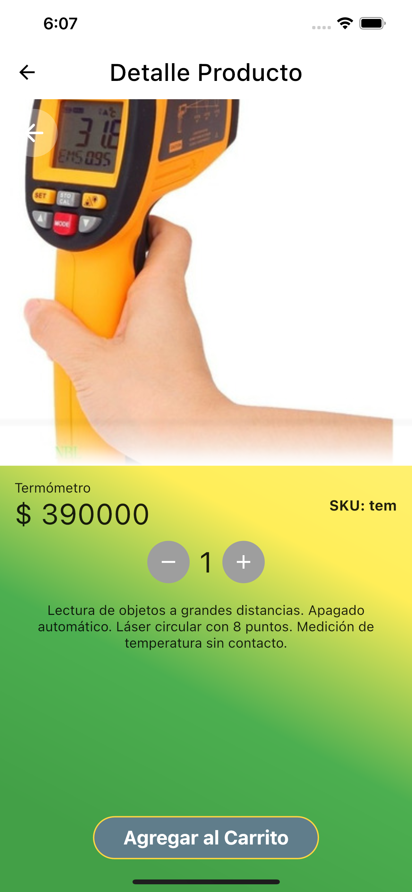
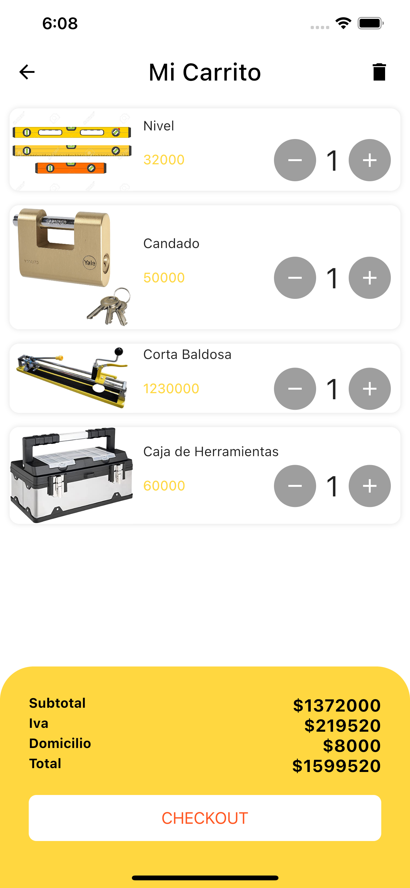

##Requerimientos técnicos para construir el proyecto.**
* Flutter 2.0.4
* Android version mínimo: Android 5.0 - 21 LOLLIPOP - Api # 21
* IOS versión mínima 12

**➢ Arquitectura.**
* Bussines Logic Component(BLOC)

**➢ Base de Datos.**
* FIREBAS -- Firestore DataBase --

**➢ Linter.**
* Pedantic

**➢ Dependencias y versiones.**

* cached_network_image: ^2.5.0  
* get_it: ^5.0.1
* flutter_bloc: ^6.1.3
* cloud_firestore: ^0.15.0
* flutter_slidable: ^0.5.7

**➢ Breve descripción de la responsabilidad de cada capa propuesta.**

* Propuesta Lista 
  Para visualizar la lista de los productos que se encuentran en la base de datos
* Propuesta Carrito de compras
  Muestra un listado de los productos seleccionados dentro del carrito con su respectivo precio y la opción de vaciar el carrito.
* Propuesta de CheckOut de la orden de Compra
  Muestra el resumen del costo con su iva, domicilio y valor total de la compra.  

**➢ Screenshots.**

  
  
  
  
  
  

