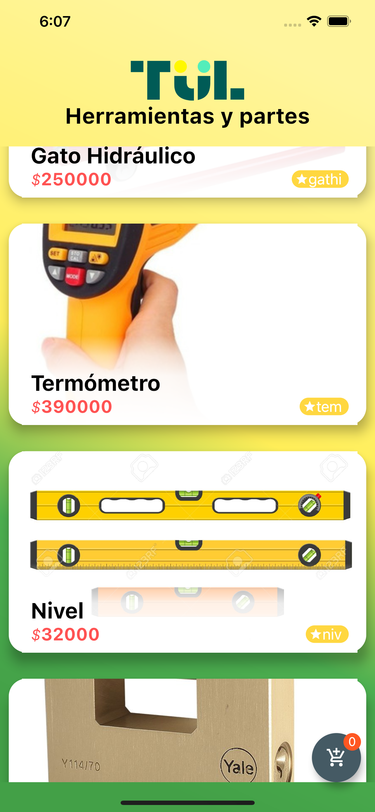

##Requerimientos técnicos para construir el proyecto.**
* Flutter 2.0.4
* Android version mínimo: Android 5.0 - 21 LOLLIPOP - Api # 21
* IOS versión mínima 12

**➢ Arquitectura.**
* Bussines Logic Component(BLOC)

**➢ Base de Datos.**
* FIREBAS -- Firestore DataBase --

**➢ Linter.**
* Pedantic

**➢ Breve descripción de la responsabilidad de cada capa propuesta.**

* Propuesta Mapa
  Para visualizar la ubicación del usuario debe aceptar los permisos que solicita la app en tiempo de ejecución.
* Propuesta Películas
  Muestra un listado de películas y cuando de click sobre una película puede obtener más información y detalle.

**➢ Screenshots que visualice las vistas solicitadas.**
<!--  -->

  
  
  
  
  
  

